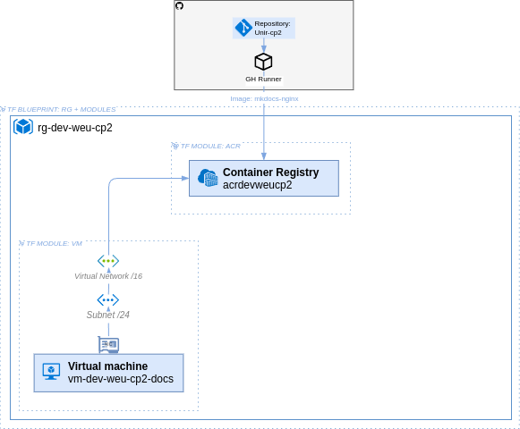

# Arquitectura

La Arquitectura organiza en dos secciones principales:

- [:simple-terraform: Infraestrutura](./infraestructura.md): contiene la descripción de los componentes desplegados con terraform y la justificación de sus parámetros.
- [:simple-ansible: Configuración de la infraestructura](./configuracion.md): las configuraciones aplicadas a la infraestructura desplegada, automatizadas con Ansible, y la justificación de cada una de ellas.

---

## Visión general

El siguiente diagrama representa la infraestructura desplegada con Terraform y configurada con Ansible, incluyendo una máquina virtual con un contenedor Podman y un clúster AKS, ambos obteniendo imágenes desde un Azure Container Registry (ACR).

{ .only-pdf }

*Figura 1: Diagrama de la arquitectura desplegada en Azure (Elaboración propia con [draw.io](../referencias.md#herramientas-usadas)).*
{ .cita }