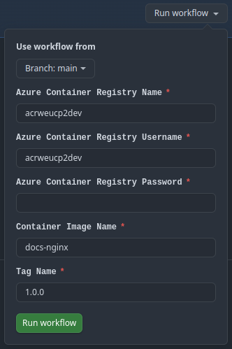

# Despliegue

A continuación, se explica cómo reproducir los pasos necesarios para llevar a cabo el caso práctico sobre el repositorio. Se detallan las instrucciones para:

- [1. Despliegue de la infraestructura](#despliegue-de-la-infraestructura)
- [2. Publicación de las imagenes](#publicacion-de-las-imagenes)
- [3. Configuración de la VM](#configuracion-de-la-vm)
- [4. Configuración del AKS](#configuracion-del-aks)

---

## Despliegue de la infraestructura

El despliegue de la infraestructura se realiza con Terraform desde la máquina local, asegurando que la configuración es válida antes de aplicar los cambios y provisionar los recursos necesarios.

1. Inicializa terraform en el directorio de ficheros terraform.

    ```sh
    terraform -chdir=./terraform init
    ```
    Output: `Terraform has been successfully initialized!`

2. Ejecuta la validación de los ficheros generados con el siguiente comando:

    ```sh
    terraform validate
    ```
    output: `Success! The configuration is valid.`

3. Despliega la infraestructura con el siguiente comando, por defecto se despliega en dev. Siempre puedes añadir el flag `-var="environment=pro"` para especificar un entorno entre `dev|pre|pro`

    ```sh
    terraform -chdir=./terraform apply --auto-approve
    ```

> Nota: Terraform necesita la clave pública SSH para provisionar la VM. Puedes pasarla directamente como texto o bien como ruta relativa a un fichero dentro del repositorio. Ejemplos:
>
> ```sh
> terraform -chdir=./terraform apply --auto-approve \
>   -var "ssh_public_key=$(cat ~/.ssh/id_rsa.pub)"
> ```
>
> ```sh
> terraform -chdir=./terraform apply --auto-approve \
>   -var "ssh_public_key=./terraform/id_rsa.pub"
> ```
>
!!! tip "Automatización de variables"

    Tras el despliegue de toda la infraestructura se generan automáticamente las variables globales necesarias para poder realizar lo que queda del ejercicio ejecutando el fichero `setup.sh`.

    ```sh
    source setup.sh
    ```

## Publicación de las imagenes

### Publicación de las imágenes mediante Ansible

Para publicar imágenes en el ACR utilizando Ansible, se ha creado un playbook llamado `publish-images.yml`. En este entorno, Ansible no está disponible en PowerShell, por lo que debe ejecutarse desde **WSL/Ubuntu** (o cualquier Linux donde Ansible esté instalado).

1. Asegúrate de tener Ansible instalado en WSL:

    ```sh
    sudo apt update && sudo apt install -y ansible
    ```

2. Ejecuta el playbook desde el directorio del proyecto:

    ```sh
    cd /mnt/c/Users/dario/Downloads/unir-cp2-main/unir-cp2-main
    ansible-playbook ansible/publish_images.yml -i ansible/hosts.yml --ask-vault-pass
    ```

Este comando construye la imagen de MkDocs, descarga la imagen pública de StackEdit y publica ambas imágenes en el ACR desde la VM.


### Publicación mediante Github Actions (fuera de alcance)

En este apartado se explica la publicación de imágenes en el ACR utilizando GitHub Actions. Aunque no formaba parte del alcance del ejercicio, se ha implementado este método para probar un flujo habitual en proyectos donde un repositorio genera y publica imágenes de contenedor tras una release.

La publicación de la imagen se automatiza mediante el workflow [`Publish mkdocs image to ACR`](https://github.com/darioreyesr25/unir-cp2/actions/workflows/publish-image-mkdocs.yml) de GitHub Actions, que envía la imagen al Azure Container Registry (ACR). Para ello, se deben proporcionar las credenciales adecuadas y validar la ejecución del proceso.

1. Rellenar los datos del formulario del workflow con username y pwd del ACR desplegado en Azure.

    ??? note "Visualizar usuario y contraseña del ACR"

        Siempre puedes ejecutar este comando para recuperar el usuario y la contraseña del ACR.

        ```bash
        az acr credential show --name acrcndcp2dev --query "[username, passwords[0].value]" -o tsv
        ```

    

2. Ejecutar workflow y validar la correcta ejecución del job


## Configuración de la VM

La configuración de la VM se llevará a cabo desde la máquina local utilizando Ansible, accediendo por SSH para realizar comprobaciones y garantizar el correcto despliegue del entorno.

1. Comprobar conexión a la VM por SSH (desde WSL/Ubuntu)

    ```sh
    ssh -i ~/.ssh/id_rsa darioreyesr25@${VM_IP}
    exit
    ```

2. Ejecutar ansible apuntando a la VM. Asegurarse que el comando se ejecuta desde `./ansible`. Para forzar ansible a recrear todo desde el principio es posible usar los argumentos `--force-handlers` y `--extra-vars "recreate=true"`.

    ```sh
    # Ejecuta este comando desde WSL/Ubuntu o desde un entorno donde Ansible esté instalado.
    ansible-playbook ansible/playbook.yml -i ansible/hosts.yml --extra-vars "@ansible/vars.yml" --ask-vault-pass
    ```

    Este playbook se ejecuta apuntando a un Vault de ansible donde se han guardado las credenciales usadas para crear el fichero `htpasswd.users` en la carpeta `/etc/nginx/auth/htpasswd.users` de la VM.

    ??? note "Mostrar contraseñas guardadas en el vault"

        Para visualizar las contraseñas guardadas en el vault puedes ejecutar el comando:
        ```sh
        ansible-vault view secrets.yml
        ```


## Configuración del AKS

El despliegue de la aplicación en el clúster de Kubernetes se realiza mediante Ansible, aplicando los manifiestos necesarios para crear el namespace, el deployment, el PersistentVolumeClaim, el Service y el secret de acceso al ACR. Todo el proceso queda automatizado en el playbook `playbook_aks.yml`.

> ⚠️ **Importante:** Este flujo está pensado para ejecutarse desde **WSL/Ubuntu** (o cualquier Linux con Ansible instalado). En Windows no está disponible `ansible-playbook` ni `kubectl` por defecto.
>
> En algunos entornos de WSL (p. ej. Docker Desktop) el disco puede montarse en **modo sólo lectura**, lo que impide instalar paquetes y ejecutar `ansible-playbook`. Si ves errores como “mounted read-only as a fallback”, reinicia/recupera WSL siguiendo:
>
> https://aka.ms/wsldiskmountrecovery
>
> Luego asegúrate de que WSL esté en modo lectura/escritura y ejecuta:
>
> ```sh
> sudo apt update
> sudo apt install -y ansible kubectl
> ```
>
> (Opcional) Si deseas usar la CLI de Azure desde WSL:
>
> ```sh
> curl -sL https://aka.ms/InstallAzureCLIDeb | sudo bash
> ```
>
> Antes de ejecutar `az aks get-credentials`, asegúrate de haber iniciado sesión en Azure:
>
> ```sh
> az login
> az aks get-credentials --resource-group rg-cnd-cp2-dev --name aks-cnd-cp2-dev
> ```
>
> > Nota: Este comando requiere que `kubectl` esté instalado en el entorno donde ejecutes el playbook (por ejemplo, WSL). El rol `aks` intentará instalarlo automáticamente si no existe.

    ```sh
    kubectl get svc azure-vote-front -n cp2 -o jsonpath="{.status.loadBalancer.ingress[0].ip}"
    ```

    La aplicación estará disponible en esa dirección IP a través del puerto 80.

🚀 Con estos pasos, se completa el despliegue y configuración íntegra del caso práctico: se ha provisionado toda la infraestructura necesaria, se han publicado las imágenes de contenedor en el ACR, y se ha puesto en marcha tanto la VM como el clúster de AKS. El entorno queda totalmente funcional, con los contenedores desplegados y ejecutándose a partir de sus respectivas imágenes.
